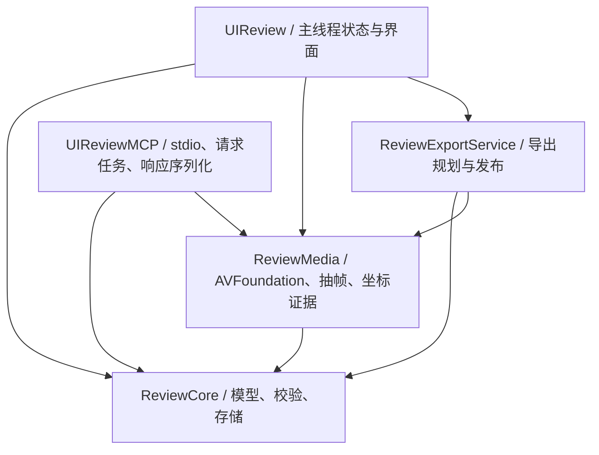

# UI Review V2 技术方案

日期：2026-09-08

状态：技术设计基线 v1；对应本机开发版已生成，完成情况与尚未验证项见 [开发交付记录](UI_Review_V2_Implementation.md)。资源上限为首版设计值，性能目标需经真实样本验证，不是测试结果。

需求依据：[PRD V2.0](UI_Review_PRD_V2.0.md)。本方案保留 macOS 14、Swift Package、SwiftUI + AppKit、本地 stdio MCP，不新增服务端或第三方媒体依赖。

## 1. 现有实现与必须调整的地方

| 源码位置 | 现状 | V2 处理 |
| --- | --- | --- |
| `ReviewCore/Models.swift` | Review 仅含 screenshots，Issue 必须有矩形 | 保留截图类型，新增 Animation 类型及混合顺序 |
| `ReviewCore/ReviewRepository.swift` | 仅接受 schemaVersion=1，原子替换 library.json | 分版本解码、备份迁移、V2 语义验证 |
| `UIReview/ReviewStore.swift` | 主线程保存，成功后才更新 library；保存失败未保留 next | 增加 working/saved revision 和串行保存；失败保留工作副本 |
| `UIReview/AnnotationCanvas.swift` | CanvasView 依赖 Screenshot，鼠标抬起提交区域 | 抽出纯坐标与拖动逻辑，截图适配器保留；视频使用确定帧适配器 |
| `UIReviewMCP/main.swift` | 同步 readLine，参数值只接受 String | 类型化 DTO 校验，异步任务分发及取消；原工具输出做 V1 投影 |
| `UIReview/AgentIntegration.swift` | 要求工具集合恰好等于现有五项 | 必需工具子集检查，区分截图可用与动画可用 |
| `ReviewCore/ReviewExport.swift` | 暂存目录后移动，整份截图 Review 导出 | 复用原子发布，新增选择范围、视频/区域证据与取消 |

不要直接给旧 Issue 添加一组 nullable 字段，也不要让所有调用方直接编码新的 Review 模型。持久化对象、MCP 响应和导出包分别用 DTO，避免一次类型扩展意外改变旧客户端响应。

## 2. 模块分工与依赖



- `ReviewCore`：新增 MotionModels、MediaTime、LibraryMigration、LibraryValidator、ReviewScope、EvidenceDTO。现有图像代码继续保留，不借机全面重构。
- 新增 Swift target `ReviewMedia`：VideoInspector、VideoImporter、FrameIndex、FrameDecoder、FrameRenderer、MediaLimits。供 App 和 MCP 共用。
- `ReviewExportService` 放在 ReviewMedia 内，复用旧截图导出能力，避免 Core 反向依赖 Media。
- App 新增 MotionSession、MotionPlayerView、MotionTimelineView、MotionIssuePanel、AlignmentEditor、FrameAnnotationCanvas。
- 播放器与 NSView 留在 App；模型与解码服务不引用 ReviewStore，不创建窗口。MCP 退出 App 后仍能独立工作。
- 保持项目当前 Swift 5 language mode；本次不同时升级 Swift 严格并发模式。新增跨任务数据使用值类型，避免把 AVFoundation 对象声明为任意可发送。

## 3. 持久化 Schema v2

### 3.1 库和 Review

`library.json` 根字段：`schemaVersion: 2`、`revision: UUID`、`currentReviewID: UUID?`、`reviews: [ReviewV2]`。每次成功持久化（包括撤销）创建新的 revision。

ReviewV2 保留 `id/title/createdAt/updatedAt/screenshots` 的原结构，新增：

| 字段 | 类型 | 规则 |
| --- | --- | --- |
| animations | `[Animation]` | V1 迁移为 [] |
| videoAssets | `[VideoAsset]` | Review 内的不可变资产目录，包括仍被问题引用的旧参考 |
| itemOrder | `[{kind: screenshot\|animation, id: UUID}]` | 恰好覆盖本 Review 的每个条目一次，无重复或悬空引用 |

截图、动画、视频资产 ID 在库内全局唯一；旧库中合法但跨 Review 重复的截图 ID 不强行改写，旧读取仍按 review_id 定位。V2 新资产分配时检查全库冲突。问题 ID 在所属条目内唯一，所有新接口用 review_id + animation_id + issue_id 解析，不假定问题 ID 全局唯一。

删除动画时不清理资产目录；撤销可恢复。只要旧问题仍引用某参考，元数据和文件都必须保留。暂不提供自动原视频垃圾回收。

### 3.2 媒体时间

JSON `MediaTime = {value: integer, timescale: integer}`，表示秒值 value/timescale。value 限于 ±(2^53−1)，timescale 为 1…2^31−1，保证 JSON 客户端整数精度。拒绝 indefinite、infinity、NaN、非零 epoch 和溢出。

导入记录视频轨道的 `timelineOrigin`，可为负数；用户可见的原视频时间定义为 sample PTS 减 timelineOrigin，从 0 起算。所有问题、对齐起点和 API 请求使用该素材局部时间；解码服务负责转换回 AVFoundation asset time。保留有理数，不用显示的毫秒往返转换。

`TemporalTarget` 为互斥结构：

- 时间点：`{kind: "point", at: MediaTime}`。
- 时间段：`{kind: "range", start: MediaTime, end: MediaTime}`，采用 **[start, end)**，0 ≤ start < end ≤ duration。

帧覆盖终点时取 end 之前最后一个合法样本；不是请求 duration 时伪造末帧。点必须指向有效帧；空区间拒绝。

### 3.3 VideoAsset

| 字段 | 类型/示例 | 用途 |
| --- | --- | --- |
| id | UUID | 资产身份 |
| originalName | String | 展示名称，不用于拼接路径 |
| path | `assets/videos/<UUID>.mp4` 或 `.mov` | 应用分配的相对路径 |
| sha256 / byteLength | hex String / Int64 | 完整性、缓存身份、导出预算 |
| container / codec | mp4\|mov / h264 | 首版支持白名单 |
| trackID | Int32 | 明确选择的唯一视频轨道 |
| timelineOrigin / duration | MediaTime | 时间映射和范围验证 |
| encodedWidth / encodedHeight | Int | 编码像素尺寸 |
| displayWidth / displayHeight | Int | 方向变换后可见帧像素尺寸 |
| preferredTransform | `{a,b,c,d,tx,ty: Double}` | 记录原方向变换 |
| nominalFrameRate | Double? | 展示与诊断，绝不用来构造逐帧时间 |
| colorPolicy | `sdr-srgb-v1` | 派生 PNG 色彩约定 |
| createdAt | ISO8601 | 导入时间 |

首版拒绝多视频轨道、受保护内容、非正方形像素或不支持的 clean aperture/任意仿射变换，返回具体原因。基础支持普通 SDR H.264、0/90/180/270 度方向与镜像；HDR/HEVC、复杂编辑轨道的支持另经验证扩展，不悄悄做失真转换。

### 3.4 Animation 与问题

Animation：`id/name/createdAt/updatedAt/currentAssetID/activeReference/issues`。

`activeReference` 为 null 或 `{referenceAssetID, currentStart, referenceStart, alignmentID}`。alignmentID 每次确认对齐新建；取消不提交。AnimationIssue：

| 字段 | 必填 | 说明 |
| --- | --- | --- |
| id | 是 | 稳定 UUID |
| target | 是 | TemporalTarget |
| comment | 是 | 可为空；空白 trim 后为空即 pending |
| expectation / component | 否 | 用户原始文字 |
| category | 否 | position/scale/opacity/timing/delay/other |
| region | 否 | 零或一个 FrameRegion |
| referenceSnapshot | 否 | 创建或明确更新时复制的参考关系 |

FrameRegion：`assetID/actualTime/frameWidth/frameHeight/pixelRect/normalizedRect`；actualTime 是当前资产的真实样本时间。pixelRect 复用现有 Region，最小宽高 2 px，全部值有限；normalizedRect 与像素推导误差 < 1e−6。一段视频的可见尺寸变化时不沿用旧区域，首版拒绝该素材并说明。

referenceSnapshot 保存 `referenceAssetID/currentStart/referenceStart/alignmentID`。不保存不必要的重复映射结果；输出时从快照与 target 计算参考时间。移除 activeReference 不删除快照。界面显示“此问题使用旧参考关系”，用户显式更新才替换。

完整 JSON 示例见 [动画问题示例](examples/motion-issue-v2.json)。示例描述的是一个 AnimationIssue 及其关联资产/参考摘要，不冒充完整 library.json。

## 4. 存储、迁移与保存事务

目录：

```text
UIReview/
  library.json
  backups/library-v1-<timestamp>-<UUID>.json
  assets/<existing-screenshot-id>.png
  assets/videos/<asset-id>.mp4
  staging/<job-id>/...
  cache/motion-v1/<sha256>/...       # 仅 App 管理，可重建
  writer.lock
```

路径校验沿用精确 ID 文件名与 resolvingSymlinksInPath 的目录边界检查。客户端不传路径；源名称不作为目标路径。资产使用 exclusive-create 防止覆盖同名文件。

迁移仅由 App 执行，MCP 永不写库：

1. 取得新版本写锁；载入原字节，先读 schemaVersion，再用相应 DTO 解码与校验。
2. V1 校验通过后，将原字节写入唯一备份文件，确认写入完成。保留所有原 ID/截图顺序/当前 Review。
3. 在内存增加 animations/videoAssets=[]、itemOrder=旧截图顺序、revision；不重编码/移动原图。
4. 校验 V2；写同卷临时库，原子替换 library.json。迁移失败不发布 V2，不把坏库替换为空库。
5. 新 MCP 遇到 V1 时只做内存投影，返回动画列表为空；遇更高未知版本则停止读取并返回 UNSUPPORTED_SCHEMA。

写锁只约束配合的新版本；不能声称阻止旧 App 写入。新 App 保存前比对磁盘 revision 或 V1 原字节 hash，检测外部变化即暂停写入并提示重新加载。发布时明确关闭旧版后迁移；回退先退出新 App，再恢复备份，新增资产可以暂留但旧版不可访问。

保存状态划分：workingLibrary、savedRevision、editGeneration、dirty/error。用户编辑先更新 workingLibrary 和撤销栈；串行存储队列发布最新版本。评论 debounce 300 ms、最多 1 s 提交一次；拖动仅 mouseUp 提交，选择、删除、切换及交接执行 flush。保存完成仅清除对应 generation 的 dirty，不能把后来的编辑标成已保存。

失败时工作副本与撤销栈保留，提供重试；MCP 仍看到最后成功快照。交接按钮先等待 flush，失败则不能复制声称包含最新修改的提示词。退出有未保存内容时提示重试或明确放弃，重启只承诺恢复已成功保存的数据。

## 5. 视频导入与资源限额

首版采用以下**实现设计上限**，放入单一 MediaLimits 配置；限额可以在专项验证后调低，调高必须重跑资源测试。

| 项目 | 设计值 |
| --- | --- |
| 单文件大小 | ≤ 500,000,000 字节 |
| 单文件时长 | ≤ 120 秒 |
| 正向帧长边 / 总像素 | ≤ 4096 / ≤ 9,000,000 |
| 支持样本速率 | ≤ 120 fps，VFR 按实际样本间距校验 |
| 样本数 | ≤ 14,401，防恶意/异常时间表 |
| 单次文件队列 | ≤ 10，依次复制；取消不撤销已成功项 |
| 导入并发 / 后台抽帧并发 | 每进程 1 / 2 |
| App 派生帧内存缓存 | 128 MiB（按实际像素字节计费） |
| App 磁盘派生缓存 | 1 GiB LRU，原视频不计入且不自动清理 |
| MCP 缓存 | 每进程内存 64 MiB，无持久化写入 |
| 空间预检 | 导入 size + 64 MiB；导出预估资产与帧 + 64 MiB，仍须处理实际 ENOSPC |

导入事务：拿 security-scoped 访问 → 验证普通文件/大小 → 在应用 staging 内分块复制并计算 SHA-256 → 对复制后的文件检查轨道、PTS、方向、首帧/中间帧/末帧 → 原子移入不可变资产路径 → 提交元数据。检验复制后的文件，避免源文件变化导致元数据与内容不一致。

复制阶段可显示真实字节进度；解码检验显示不确定进度。取消关闭读取与解码任务，只清理本 job 临时文件。库提交失败后的已发布资产先保留为孤立资产，不交给 MCP，避免误删其他引用。

## 6. 帧索引、解码与标注坐标

### 6.1 精确帧时间

FrameIndex 首版使用 AVAssetReader 的解码输出，逐个读取有 imageBuffer 且 PTS 有效的展示帧，及时释放像素，只保留时间索引。记录样本 duration 或下一 PTS 的有效间隔。解码顺序不当作展示顺序，处理 B 帧重排；重复/无效/非单调展示时间表无法规范化时明确拒绝。

第一轮实验发现 outputSettings:nil 的压缩读取包含非展示帧项和时间偏移，仅排序无法构造正确索引。因此先采用解码帧基线；若后续优化为压缩索引，必须单独处理样本标记与时间映射并通过相同 oracle 验证。索引耗时尚未测定，长素材仍需后台进度与取消。

下一帧/上一帧从索引找严格相邻 PTS；任意 seek(t) 选择覆盖 t 的样本，尾部使用最后有效样本，gap 则报告 NO_FRAME。序列取样先生成区间内的候选时间，再映射到索引并去重。

FrameDecoder 用 AVAssetImageGenerator，设置 appliesPreferredTrackTransform=true；证据帧设置前后容差 zero。Apple 文档明确零容差请求会增加解码成本，不能据此承诺固定耗时。每个响应包含 requestedTime、actualTime；若返回时间不等于索引目标，不允许建立“精确帧”区域，进入解码失败/重试状态。[Apple 精确抽帧说明](https://developer.apple.com/documentation/avfoundation/avassetimagegenerator/requestedtimetolerancebefore)

### 6.2 播放与框选共用画面

播放时使用 AVPlayerLayer；进入框选后暂停、完成精确取帧，再用该 CGImage 替换播放层显示，区域只在这张稳定图片上编辑。锁定 `FrameIdentity(assetID, actualTime, displayWidth, displayHeight, decoderVersion)`。

复用现有画布拖动数学，新增 FrameCanvasInput，包含图像、尺寸、区域显示列表与回调；Screenshot 适配器保持截图语义。区域 CRUD 路由到动画问题，不把帧注册成普通 Screenshot。

坐标换算：`scale=min(contentWidth/frameWidth,contentHeight/frameHeight)`；`pixel=(pointer-contentRect.origin)/scale`。起点在黑边/留白不开始绘制，后续拖动 clamp 到帧；反向拖动标准化为 min/max，镜像/旋转已体现在 CGImage 中，不再重复变换。

证据 PNG 可缩小；必须同时返回 sourceSize、renderedSize、scale。矩形先在原帧空间绘制再缩放，像素/归一化坐标仍对应 sourceSize，不能拿缩略图尺寸覆盖原帧尺寸。

## 7. 播放同步与 UI 状态机

MotionSession 是 @MainActor 生命周期对象，持有当前/参考 player、播放头、选段、selectionGeneration、frameRequestGeneration 和当前问题。SwiftUI body 不创建播放器。

状态：`idle → loading → paused(frameIdentity) ↔ playing`；定位经过 `seeking`，框选经过 `drawing(preview)`，错误进入 `failed(retryContext)`。只能从精确 paused 状态进入 drawing。

- 切换素材/Review、对齐关系改变、拖动时间轴：递增 generation，取消旧 seek/抽帧。异步完成必须同时验证请求 generation、素材 ID、问题 ID 后才更新画面。
- 播放、seek 或切换时取消未完成矩形，保留已保存矩形；Esc 恢复旧区域。mouseUp 验证同一 FrameIdentity 后一次提交。
- 双视频采用共享 host time 调度。两个 player 预加载后通过 setRate(_:time:atHostTime:) 在同一 host time 启动；按 Apple 要求设置 automaticallyWaitsToMinimizeStalling=false，自己处理 stall。[Apple 同步播放说明](https://developer.apple.com/documentation/avfoundation/avplayer/setrate(_:time:athosttime:))
- 每 100 ms 检查局部时间差。偏差超过 max(33 ms, 两侧较长帧间隔) 时暂停两侧并重新定位，不悄悄改变播放速度；恢复时沿用原速率。
- 暂停比较按同一相对时间分别取得覆盖该时刻的真实帧，允许不同帧率导致 PTS 不同；显示两侧 actualTime。
- 同步范围覆盖两侧可映射的可见区间，某侧越界时显示缺帧/末帧状态，该侧不 seek 到非法时间。

## 8. MCP 契约

### 8.1 旧工具保持 V1 投影

原五工具参数与响应保持截图语义：get_review/get_current_review 继续返回原截图 Review 字段；list_reviews 中 screenshotCount/issueCount 仍为截图计数；get_issues 仍按截图分组。App 自己的总问题数可包含动画，不能复用到旧 MCP issueCount。

新增四个工具形成发现与证据链；initialize.instructions 引导动画任务使用 list_animations，serverInfo.version 升为 2.0.0，协议版本协商保留现有支持列表。

| 工具 | 参数 | 返回 |
| --- | --- | --- |
| list_animations | review_id 可选；limit 默认20、1…100；cursor 可选 | reviewID、libraryRevision、动画摘要（ID/名称/问题数/参考状态）、nextCursor |
| get_animation | review_id、animation_id 必填；expected_revision 可选 | 完整动画、关联视频元数据、问题/参考快照、availability、libraryRevision |
| get_animation_frame | review_id、animation_id 必填；issue_id 或 time（二选一）；source=current\|reference 默认current；variant=original\|annotated 默认original；max_dimension 默认1280、256…2048；expected_revision 可选 | 一份帧元数据 text + 一个 PNG image |
| get_animation_frames | review_id、animation_id、issue_id 必填；source 同上；count 默认3、2…8；max_dimension 默认1024、256…1280；expected_revision 可选 | 有限帧清单 text + 按清单顺序排列的 PNG image，warnings |

参数 time 使用 MediaTime 对象，拒绝字符串毫秒、未知字段、bool 冒充数字和非整数 timescale。variant=annotated 必须指定有 region 的 issue_id 且 source=current；其他组合返回 INVALID_ARGUMENT。

get_animation_frame 的 issue_id 模式：current 有区域时取标注帧，无区域取时间点或范围内首帧；reference 使用该问题的快照映射当前选定时间。time 模式表示所选 source 的素材局部时间；source=reference 且没有 issue_id 时使用 activeReference 的资产，**不**解释为相对时间。

get_animation_frames 仅接受 range 问题，point 返回 USE_SINGLE_FRAME；用区间内均匀候选生成有界列表，强制候选在 [start,end)，映射实际帧后去重。count 是每个 source 的上限，客户端分别调用 current/reference，依据 requestedTime 对照；发生缺帧时清单保留相应失败项，不伪造图片。

所有新响应包含当前 libraryRevision。调用方可通过 expected_revision 锁定串联读取；磁盘 revision 已变时返回 STALE_REVIEW，不对旧元数据配新图片。cursor 编码 revision/reviewID/lastID 并验证，库变化使分页失效；不把 cursor 当任意文件路径。

### 8.2 帧响应元数据与预算

每个 frame 记录 assetID、source、requestedTime、actualTime、sourceSize、renderedSize、coordinateSystem、region（可选）、contentIndex。原始媒体路径不供客户端任意读盘；需要完整文件使用 App 导出。

新工具序列化后的整条 JSON-RPC 响应上限 **12,000,000 字节**（包含 base64 与元数据）。单 PNG 上限 4,000,000 字节。帧默认最大边受请求上限约束，超预算逐步缩小到 256 并返回 scale/warning；仍超预算时减少序列帧，优先保留首尾，明确 requestedCount/returnedCount/omittedTimes，至少一张也放不下则 RESPONSE_TOO_LARGE。

一次最多 8 张，PNG 按实际编码后字节计费，不能用像素估算冒充响应预算。旧 get_screenshot 维持当前 25 MB 原始 PNG 上限，避免此次强改旧契约；更改该限制另行版本化。

### 8.3 任务、取消与只读边界

MCP 改为 @main 异步入口：独立串行读取 stdin，按 request ID 分发任务；stdout 由单一 writer 串行写完整 JSON 行。请求可乱序完成但 ID 必须正确。日志仅 stderr。

同时最多 2 个抽帧任务、8 个等待任务，超额 BUSY；普通元数据请求不排在耗时解码后面。notifications/cancelled 取消对应 job、reader/generator 并释放配额；旧的“通知全部忽略”逻辑需替换。

抽帧单请求超时 15 s、序列 30 s；超时取消 generator，响应 TIMEOUT。不能假设 Task.cancel 会终止底层解码，必须调用媒体取消 API；资源未释放不继续启动无限任务，必要时结束该 MCP 进程由客户端重启。

MCP 不执行迁移，不写库，不写持久化缓存，不修改客户端配置；内存帧缓存只按预算复用。对元数据声明为可用的资产，取帧前验证存在、大小及内部路径边界；首次使用校验 hash，后续按文件身份/mtime/size 检测变化，篡改时报 ASSET_CHANGED，不复用旧证据。

工具业务错误用 isError=true + `{code,message,retryable,details}` 文本内容；JSON-RPC 解析/参数错误维持对应 RPC 错误。固定代码包括 INVALID_ARGUMENT、NOT_FOUND、UNSUPPORTED_SCHEMA、UNSUPPORTED_MEDIA、ASSET_MISSING、ASSET_CHANGED、NO_FRAME、STALE_REVIEW、BUSY、TIMEOUT、RESPONSE_TOO_LARGE、CANCELLED。部分帧成功用 isError=false + failedFrames/warnings，明确不完整。

AgentIntegration 改为验证原五项是工具集合子集，所有公开工具 readOnlyHint=true；动画四项齐全时才显示“动画读取可用”。旧版服务仍可显示“截图可用，动画需升级”，不得把九个工具判为握手失败。同步更新 scripts/test-mcp.py 与连接检测测试。

## 9. 交接与导出实现

复制提示词由纯函数生成，工具栏提供两个范围：当前素材（`MotionExport.selected`）与整个 Review。复制与导出前 flush；不再弹出交接预览，也不再按预览切换导出范围。导出永远是整份当前 Review。

复制提示词写明范围与稳定 ID，并要求先读对应元数据再获取原图/标注图；动画可使用 expected_revision 校验。过期提示词仍指向同一对象，若要求的 revision 不再可用则报告变化并重新读取，不能悄悄修复另一个当前 Review。

导出包使用 `formatVersion: 2`，避免混淆持久化 schemaVersion。纯截图旧导出结构由 ReviewExport 保持；含视频时确认完整录屏体积后走 MotionExport.write。全部路径为包内相对路径。

步骤：同卷暂存目录 → 复制原图/完整视频/实际引用旧参考 → 生成原帧与标注帧/序列 → 写 JSON/Markdown → 校验所有引用和字节/hash → 原子移动为最终目录。文件夹只在完整成功时发布，不覆盖已有文件。

用户评论以引用文本输出，文件名和标题转义；不把评论当路径、命令或结构化参数。取消仅删本次 staging；写入失败不删输入数据。派生原帧采用完整可见分辨率输出，MCP 的缩图预算不限制文件导出；导出也按序流式生成，不同时保留所有帧。

## 10. 验证与性能门槛

本机候选基准环境：MacBook Air M4、32 GB、macOS 26.6.1。[T0 第一轮报告](motion-t0-validation.md)已验证四种合成样本共 120 次精确取帧，1080p/60 fps 新建生成器取帧 P95 为 48.88 ms；这不包含索引、冷磁盘与 UI 耗时。仍需 macOS 14、真实录屏、双播放器同步及色彩一致性验证。

| 项目 | 首版验收目标（待测） |
| --- | --- |
| 标准样本 | 10 秒、1080p、SDR H.264，30/60 fps，竖屏和横屏 |
| 冷精确取帧 P95 | ≤ 1 s，至少 30 个不重复时间点 |
| 缓存命中取帧 P95 | ≤ 150 ms |
| 两视频播放 | 标准样本持续 10 s，不出现未提示的持续 >100 ms 漂移 |
| 取消反馈 | UI 在 200 ms 内显示取消中；任务不得继续发布结果 |
| 重复操作 | 100 次素材切换/定位后缓存不超预算，无持续增长的播放器/观察者 |
| 窗口 | 初始 1280×820，最低 1100×760；画布自适应，不裁掉框选/评论/交接入口 |

真实样本矩阵：30/60 fps、VFR、B 帧、90/180/270 旋转、镜像、文件末尾、非零起始 PTS、长 GOP、损坏中间帧、临界大小/时长、越界参考。HEVC/HDR/非正方像素先验证清楚拒绝；通过验证后再讨论支持。

测试分层：

- Core：有理时间比较与半开区间、归一化误差、ID/引用/路径、V1 字节备份、迁移失败、未知版本。
- Store：保存失败保留工作副本、过期保存完成、撤销/重做、跨素材取消、问题范围和区域约束。
- Media：已知 PTS 与角落标记的视频证明方向/取帧/框选一致；索引不使用 nominalFrameRate 推算。
- MCP：真实 stdio 进程的旧五工具投影、九工具检测、数字参数拒绝/接受、响应预算、并发取消、App 退出后取帧、revision 变化。
- Export：包移动后的路径解析、区域图位置、原视频及旧参考完整性、失败/取消不发布。
- UI：实际鼠标绘制、移动、缩放、Esc、R/V、输入框内 Delete、切换时晚回调、同步误差记录。

## 11. 开发拆分与退出条件

| 批次 | 文件/职责 | 前置与交付 |
| --- | --- | --- |
| T0 | ReviewMedia 最小验证程序与样本 | 冻结可解码类型、PTS/方向规则和预算；记录真实结果 |
| T1 | Core 模型、V2 validator、migration、DTO | 保留 V1 回归，迁移失败不覆盖旧库 |
| T2 | Store 保存队列、selection、working/saved revision | 保存/撤销状态可验证，未实现视频前截图行为仍通过 |
| T3 | Importer、FrameIndex/Decoder、单视频 UI/框选 | 真拖绘与时间绑定通过 PRD A02–A09 |
| T4 | 参考/对齐/session generation | PRD A10–A13，旧参考快照可追溯 |
| T5 | MCP handlers、probe、复制提示词/导出 | PRD A14–A17，完整 Agent 获取证据闭环 |

不在技术文档阶段改生产模型或迁移真实数据。T0 通过后才能宣称 D0 的运行时验证完成；本方案先冻结行为与接口选择，资源设计值依据测试结果修订并保留记录。

## 12. 关键决策摘要

- 沿用截图模型，动画独立建模；持久化和协议 DTO 分离。
- 稳定帧上框选，不直接在正在变化的播放器画面上保存坐标。
- 有理数时间 + 真实 PTS 索引；对齐只平移，不改变时长。
- 旧 MCP 工具保持截图投影，新增四工具；连接检测支持能力子集。
- App 唯一写者，MCP 不迁移/不写缓存；保存失败保留待保存内容。
- 原素材不可变，历史参考快照保留；输出用 revision 防止混合不同版本证据。
